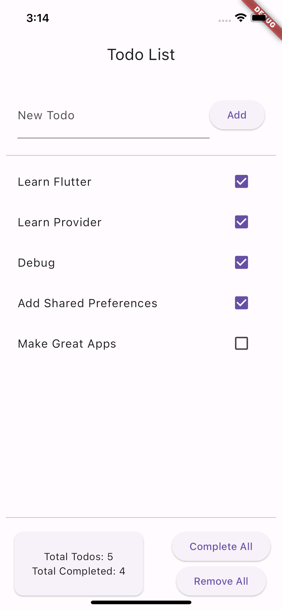

# Todo App

A simple todo app built with Flutter that demonstrates the usage of the `provider` package for state management. The app also utilizes `shared preferences` for persisting the todo list.

## Overview

The Todo App allows users to create a list of todos and mark them as completed. It showcases the basic features of the `provider` package, including listening to changes, accessing state without listening, and selecting specific parts of the state. The app also uses shared preferences to persist the todo list so that it can be loaded between app sessions.

## Features

- Add new todos to the list.
- Toggle the completion status of todos.

## Screenshots



## Dependencies

- Flutter
- provider
- shared_preferences

## Getting Started

1. Clone the repository:

   ```bash
   git clone https://github.com/your-username/todo-app.git
   ```

2. Navigate to the project directory:

   ```bash
   cd todo-app
   ```

3. Install the dependencies:

   ```bash
   flutter pub get
   ```

4. Run the app:

   ```bash
   flutter run
   ```

## Usage of `provider` and Shared Preferences

The `provider` package is used for managing the state of the todo list in this app, while shared preferences is used for persisting the todo list between app sessions.

### Provider Setup

- The `TodoListProvider` is set up as the provider for managing the state of the todo list.
- It extends `ChangeNotifier` and provides methods to add a todo, toggle todo completion, and complete all todos.
- It exposes getters for accessing the list of todos, total number of todos, and total number of completed todos.

### Shared Preferences Integration

- The `TodoListProvider` uses shared preferences to persist the todo list.
- When the app starts, the `loadTodos` method is called to retrieve the persisted todo list from shared preferences.
- When a todo is added or its completion status is toggled, the `saveTodos` method is called to update the persisted todo list in shared preferences.

### TodoListScreen

- The `TodoListScreen` is the main screen of the app.
- It includes an `AppBar`, an input field for adding new todos, the todo list, the todo count, and a button to complete all todos.

### Adding a Todo

- When the user taps the "Add" button, the `_addTodo` method is called.
- It retrieves the `TodoListProvider` using `Provider.of` and adds a new todo to the list.

### TodoList

- The `TodoList` widget displays the list of todos.
- It uses `context.watch` to listen to changes on `TodoListProvider`.
- The list view is built using `ListView.builder`, and each todo is displayed as a `ListTile` with a checkbox for marking it as completed.

### TodoCount

- The `TodoCount` widget displays the total number of todos and the total number of completed todos.
- It utilizes `context.select` to select the relevant values from `TodoListProvider` without rebuilding when other parts of the state change.

### Completing All Todos

- The "Complete All" button in the `TodoListScreen` triggers the `completeAllTodos` method.
- It retrieves the `TodoListProvider` using `context.read` and calls the `completeAllTodos` method to mark all todos as completed.
- The `TodoListProvider` internally updates the state and triggers a rebuild of the relevant widgets.


## Persistence with Shared Preferences


- The app uses the `shared_preferences` package to persist the todo list.
- The `TodoListProvider` utilizes shared preferences to load and save the todo list.
- When the app starts, the `loadTodos` method retrieves the persisted todo list from shared preferences and updates the provider's state.
- When a todo is added or its completion status is toggled, the `saveTodos` method is called to update the persisted todo list in shared preferences.

